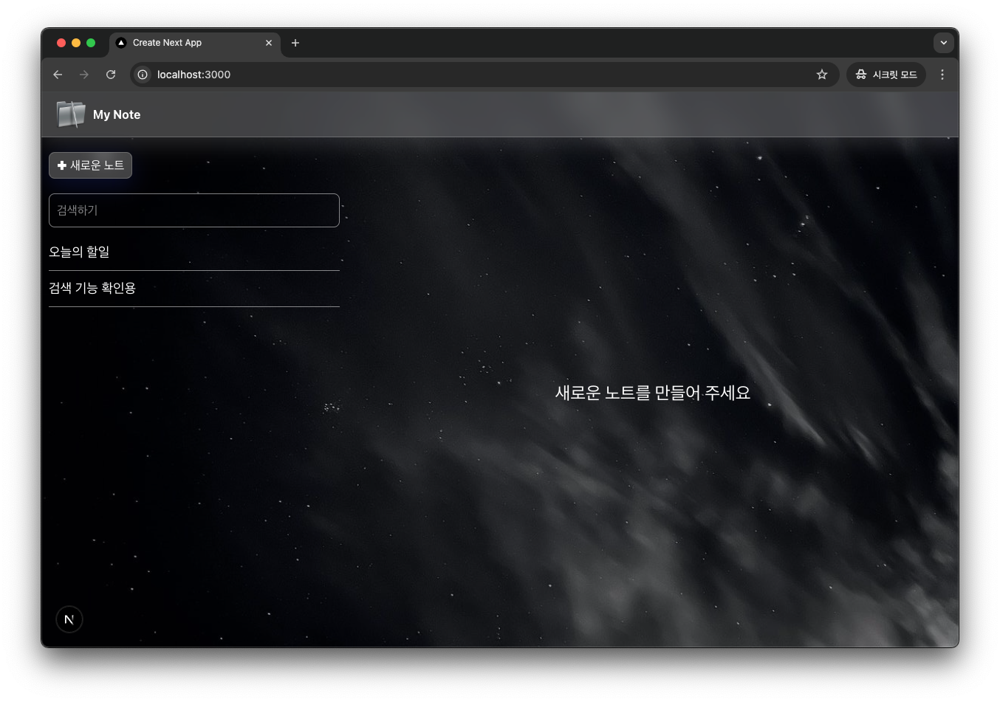
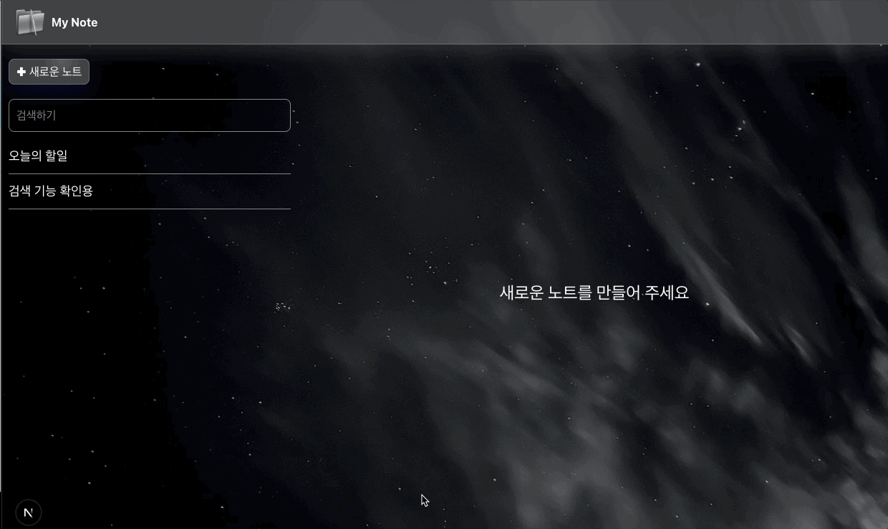

## My Note

- 노트앱을 만들면서 익혀보는 next.js + supabase
- 노트 생성 / 수정 / 삭제 / 검색 기능 구현

### 완성 이미지




### supabase

- 타입파일 생성하는 법

```bash
{
  "scripts": {
    # ...
    "generate-types": "npx supabase gen types typescript --project-id [project_id] --schema public > types_db.ts"
  }
}
```

- 테이블 타입 사용하기

```tsx
import { TablesInsert, Tables } from '@/types_db'; // 상단에서 만든 타입 유틸 사용

...

const { data, error } = await supabase
  .from('note')
  .insert<TablesInsert<'note'>>({
    title,
    content,
  })
  .select(); // 반환 타입은 Tables<'note'>[] | null

...
```

- [기본 문법](https://lopunko.notion.site/Supabase-f6b1fe82197d49c0b7f0582c17732e38)
